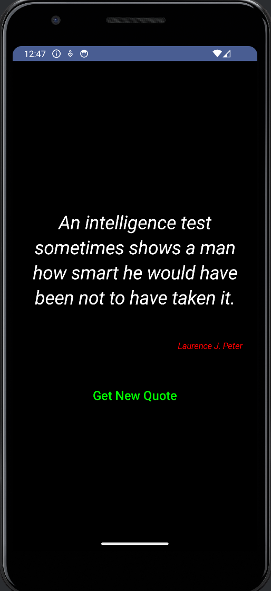

# Random Quotes
> Get a random quote by pressing a button

This is a simple Android app written in Kotlin and Compose.

This is basically a copy of what I picked from this
[YT video](https://youtu.be/ytEArKJXNNg?si=cm1Z6Nv5wv0jwEmX).
The difference is that in that video they were not using Jetpack Compose.

So after watching a number of great tutorials by:
[Philipp Lackner](https://www.youtube.com/@PhilippLackner) , I managed
to put together this random quote app using Compose.

## Screenshot

